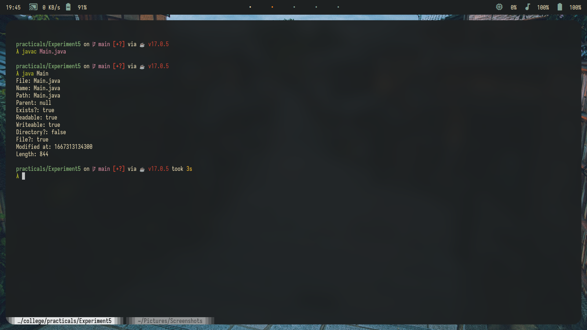
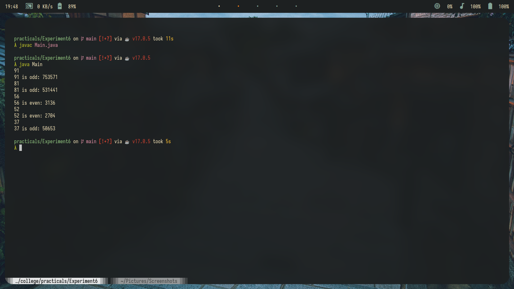

# Practicals Solutions for Java

Here you have all the solutions for all the experiments in the manual, except it is shortened.


Please refer to the notes present below if there's any problem compiling!


I am not responsible if you get caught cheating/copying the source code... This is only for studying purposes...


# Output
## Experiment 1


## Experiment 2


## Experiment 3


## Experiment 4


## Experiment 5


## Experiment 6



# Note

## Experiment 3

compile with the following command for it to execute properly

```
javac Main.java -Xlint:deprecation
java Main
```
